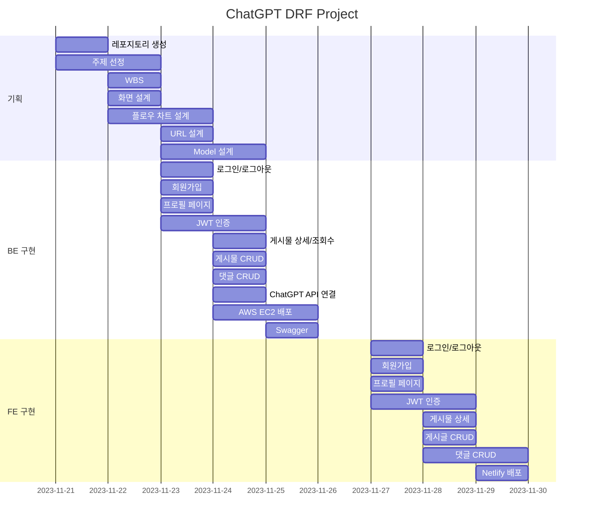

# Django DRF Project - AI 지식인 서비스
  * 질문을 하면 ChatGPT가 답변을 해주는 서비스 입니다.
  * 내가 한 질문과 ChatGPT의 답변이 게시물로 생성됩니다.
  * 다른 사람들의 질문들을 볼 수 있습니다.
    
## 1. 목표와 기능
  1.1 목표
   * DRF(Django REST Framework)를 이용한 REST API 구현
   * ViewSet을 사용해서 CRUD 기능 설계
   * Accounts(Login, Logout) 인증 방식 JWT 사용
   * ChatGPT API 사용
   * AWS에 서버 배포
   * HTML + Vanilla JS로 간단한 Front-End 구현
   * Netlify로 FE 배포

  1.2 기능
   * 회원가입 혹은 로그인 후, 글쓰기를 통해 카테고리를 선택하여 질문을 할 수 있습니다.
   * 내가 한 질문과 ChatGPT의 답변이 게시물로 생성됩니다.
   * 메인화면에서 모든 질문들을 볼 수 있습니다.
   * 상세 게시물에서 조회수와 추천수를 확인 할 수 있습니다.
   * 게시물에 추천을 누르거나 댓글을 작성할 수 있습니다.

## 2. Stacks 및 배포 URL

  ### 2.1 Stacks
  
  * Enviroment

    
    
    

 

  * Development


    
    
    
    
 


  * DataBase
    
    


  ### 2.2 배포 URL
   
   [https://stupendous-elf-84bccd.netlify.app/](https://stupendous-elf-84bccd.netlify.app/)

    - test ID : test
    - test PW : mypw1234

## 3. 아키텍처/URL 구조 및 플로우 차트

  ### 3.1 아키텍처 구조
  


### 3.2 URL 구조

Swagger link : [http://52.78.33.155:8000/api/schema/swagger-ui/](http://52.78.33.155:8000/api/schema/swagger-ui/)
<br></br>

- accounts

| App       | Method        | URL                               | Views Class        | Note           |
|-----------|---------------|-----------------------------------|------------------- |----------------|
| accounts  | POST   | '/accounts/join/'                         |   -                 |회원가입  |
| accounts  | POST   | '/accounts/login/'                         |   -                 |로그인  |
| accounts  | POST   | '/accounts/logout/'                         |   -                 |로그아웃 |
| accounts  | GET   | '/accounts/profile/'                         |   ProfileViewSet       |내 프로필  |

- blog

| App       | Method        | URL                               | Views Class        | Note           |
|-----------|---------------|-----------------------------------|------------------- |----------------|
| blog  | GET   | '/blog/posts/'                         |   PostViewSet                 |게시글 목록 |
| blog  | POST   | '/blog/posts/'                       |   PostViewSet                 |게시글 생성  |
| blog  | GET   | '/blog/posts/{post_id}/'                |    PostViewSet       |게시글 상세보기 / 게시글 조회수 증가 |
| blog  | PATCH   | '/blog/posts/{post_id}/'                  |   ProfileViewSet    |게시글 수정 |
| blog  | DELETE   | '/blog/posts/{post_id}/'                   |   ProfileViewSet    |게시글 삭제 |
| blog  | POST   | '/blog/posts/{post_id}/like/'                   |   ProfileViewSet    |게시글 좋아요 증가|
| blog  | GET   | '/blog/posts/{post_id}/comments/'                   |   CommentViewSet    | 게시물의 댓글 목록 |
| blog  | POST   | '/blog/posts/{post_id}/comments/'                   |   CommentViewSet    | 게시물의 댓글 생성 |
| blog  | GET   | '/blog/posts/{post_id}/comments/{comment_id}/'       |   CommentViewSet    | 게시물의 특정 댓글 보기 |
| blog  | PATCH   | '/blog/posts/{post_id}/comments/{comment_id}/'       |   CommentViewSet    | 게시물의 특정 댓글 수정 |
| blog  | DELETE   | '/blog/posts/{post_id}/comments/{comment_id}/'       |   CommentViewSet    | 게시물의 특정 댓글 삭제 |


### 3.3 플로우 차트

메인페이지


게시글 상세보기


## 4. 디렉토리 구조와 개발일정(WBS)

### 4.1 디렉토리 구조
```
├── 📂FE
│   ├── js
│   │   ├── accounts
│   │   │   ├── accounts-join.js
│   │   │   ├── accounts-login.js
│   │   │   ├── accounts-logout.js
│   │   │   └── accounts-profile.js
│   │   └── blog
│   │       ├── blog-create.js
│   │       └── blog-main.js
│   └── templates
│       ├── accounts
│       │   ├── join.html
│       │   ├── login.html
│       │   ├── logout.html
│       │   └── profile.html
│       └── blog
│           ├── create.html
│           └── index.html
├── README.md
├── 📂accounts
│   ├── __init__.py
│   ├── __pycache__
│   ├── admin.py
│   ├── apps.py
│   ├── managers.py
│   ├── migrations
│   ├── models.py
│   ├── serializers.py
│   ├── tests.py
│   ├── urls.py
│   └── views.py
├── 📂blog
│   ├── __init__.py
│   ├── __pycache__
│   ├── admin.py
│   ├── apps.py
│   ├── migrations
│   │   ├── __init__.py
│   │   └── __pycache__
│   ├── models.py
│   ├── permissions.py
│   ├── serializers.py
│   ├── tests.py
│   ├── urls.py
│   └── views.py
├── db.sqlite3
├── manage.py
├── media
├── 📂project
│   ├── __init__.py
│   ├── __pycache__
│   ├── asgi.py
│   ├── settings.py
│   ├── urls.py
│   └── wsgi.py
├── requirements.txt
└── static
```

### 4.2 개발일정(WBS)


## 5. ERD 


## 6. UI 

* 로그인/로그아웃


* 회원가입


* 프로필


* 글쓰기


* 좋아요/댓글작성


* 댓글 삭제


* 게시글 삭제


## 7. 에러와 에러 해결
